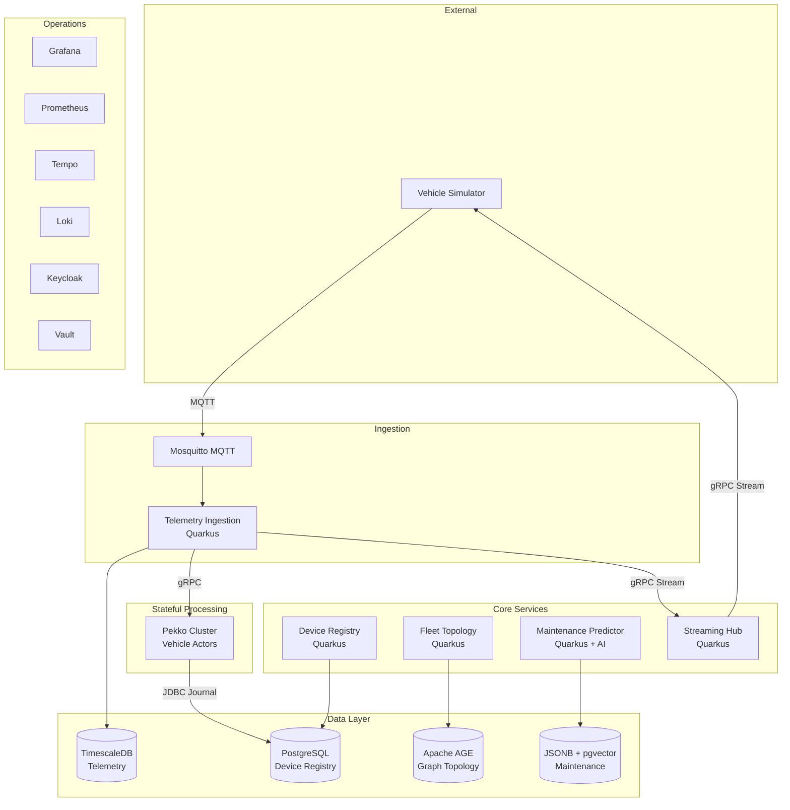
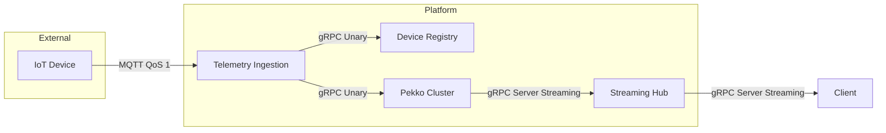

# FleetIQ — Distributed IoT Fleet Management Platform

A portfolio project demonstrating modern backend architecture patterns using **Quarkus**, **Apache Pekko**, and **PostgreSQL** with specialized extensions.

## Architecture Overview



## **Technology Stack**

| Layer         | Technology                                       | Purpose                                       |
|:--------------|:-------------------------------------------------|:----------------------------------------------|
| Runtime       | Quarkus 3.19                                     | Microservices framework, GraalVM native       |
| Actor Model   | Apache Pekko 1.1                                 | Stateful vehicle processing, cluster sharding |
| AI/ML         | LangChain4j                                      | Predictive maintenance with RAG               |
| Database      | PostgreSQL 16 \+ TimescaleDB, AGE, pgvector      | Time-series, graph, vector search             |
| Messaging     | MQTT (Mosquitto)                                 | Device telemetry ingestion                    |
| RPC           | gRPC                                             | Inter-service communication \+ streaming      |
| Security      | Keycloak \+ Vault \+ mTLS                        | Identity, secrets, zero-trust                 |
| Observability | OpenTelemetry → Grafana, Prometheus, Tempo, Loki | Metrics, traces, logs                         |
| Deployment    | Kubernetes \+ Knative \+ Istio \+ ArgoCD         | Cloud-native GitOps                           |

## **Key Architectural Patterns**

### **Hexagonal Architecture (Ports & Adapters)**

Every service follows a strict separation between domain logic and infrastructure:

```text
adapter/inbound/grpc  ──►  domain/port/inbound  ──►  domain/service  ──►  domain/port/outbound  ──►  adapter/outbound/persistence
```

* **Domain layer** has zero framework dependencies
* **Adapters** handle protocol-specific concerns (gRPC, MQTT, JDBC)
* **Ports** are pure Java interfaces defining the contract

### **Actor Model (Pekko)**

Each physical vehicle is represented as a stateful actor:

* **Location-transparent** addressing via Cluster Sharding
* **Event-sourced** state with Pekko Persistence (JDBC journal)
* **Supervision hierarchy** for fault tolerance
* **Dead letter monitoring** for failed commands

### **Database per Service**

Single PostgreSQL cluster with logical separation via databases:

| Service               | Database             | Specialization              |
|:----------------------|:---------------------|:----------------------------|
| Telemetry Ingestion   | telemetry\_db        | TimescaleDB hypertables     |
| Device Registry       | device\_registry\_db | Standard relational         |
| Fleet Topology        | topology\_db         | Apache AGE graph \+ PostGIS |
| Maintenance Predictor | maintenance\_db      | JSONB documents \+ pgvector |
| Pekko Journal         | pekko\_journal\_db   | Event journal \+ snapshots  |

### **Communication Protocols**



## **Quickstart**

### **Prerequisites**

* Java 25+
* Docker Desktop
* Maven 3.9+

### **Start Development Environment**

```bash
# Clone and build
git clone https://github.com/your-org/fleetiq.git  
cd fleetiq  
mvn install -DskipTests

# Start infrastructure
cd infra/docker-compose  
docker compose up -d

# Start services (each in a separate terminal)*  
cd services/telemetry-ingestion  
mvn quarkus:dev -Dquarkus.test.continuous-testing=disabled

cd services/device-registry  
mvn quarkus:dev -Dquarkus.test.continuous-testing=disabled

# ... repeat for other services

# Start simulator  
cd simulator
mvn quarkus:dev -Dquarkus.test.continuous-testing=disabled
```

### **Access Services**

| Service               | URL                                             |
|:----------------------|:------------------------------------------------|
| Telemetry Ingestion   | [http://localhost:8081](http://localhost:8081/) |
| Device Registry       | [http://localhost:8082](http://localhost:8082/) |
| Fleet Topology        | [http://localhost:8083](http://localhost:8083/) |
| Maintenance Predictor | [http://localhost:8084](http://localhost:8084/) |
| Streaming Hub         | [http://localhost:8085](http://localhost:8085/) |
| Grafana               | [http://localhost:3000](http://localhost:3000/) |
| Keycloak              | [http://localhost:8080](http://localhost:8080/) |
| Vault                 | [http://localhost:8200](http://localhost:8200/) |

## **Project Structure**

```text
fleetiq/  
├── proto/                 \# Shared Protobuf definitions  
├── services/              \# Quarkus microservices  
│   ├── telemetry-ingestion/  
│   ├── device-registry/  
│   ├── fleet-topology/  
│   ├── maintenance-predictor/  
│   └── streaming-hub/  
├── pekko-cluster/         \# Apache Pekko actor system  
├── simulator/             \# Vehicle simulator utility  
├── infra/                 \# Infrastructure as Code  
│   ├── docker-compose/    \# Local development  
│   ├── kubernetes/        \# K8s manifests (Kustomize)  
│   └── grafana/           \# Monitoring dashboards
└── docs/                  \# Architecture documentation
```
