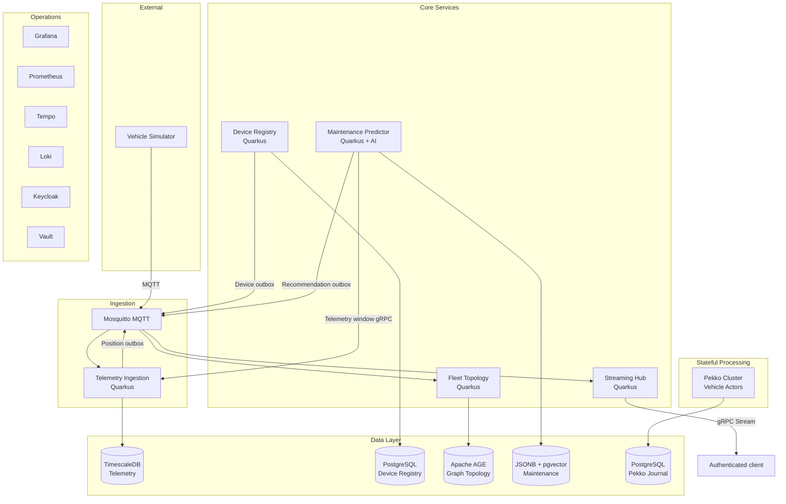
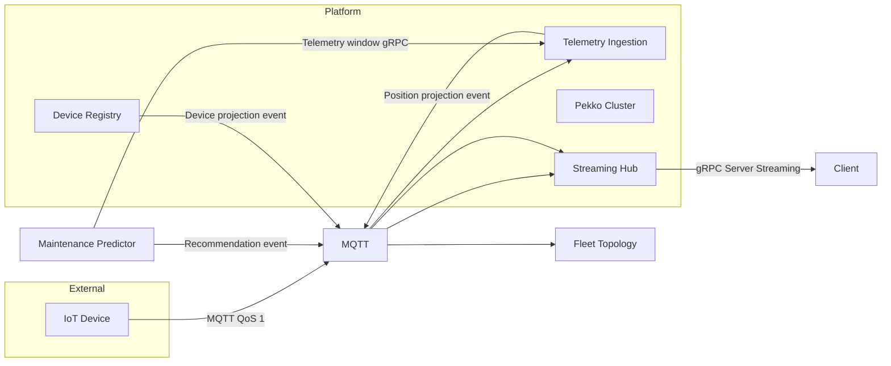

# FleetIQ — Distributed IoT Fleet Management Platform

A portfolio project demonstrating modern backend architecture patterns using **Quarkus**, **Apache Pekko**, and **PostgreSQL** with specialized extensions.

## Documentation

- [Documentation index](docs/README.md)
- [Implementation roadmap](docs/implementation-roadmap.md)
- [Minimum viable baseline release](docs/mvb-release.md)
- [MVB verification record](docs/mvb-verification.md)
- [Architecture baseline](docs/architecture-baseline.md)
- [Testing strategy](docs/testing-strategy.md)
- [Deployment ownership](docs/deployment-ownership.md)

Each deployable or shared module also contains a focused `README.md` describing its
responsibility, boundaries, runtime dependencies, and verification command.

## Architecture Overview


```mermaid
graph TB
    subgraph "External"
        SIM[Vehicle Simulator]
    end

    subgraph "Ingestion"
        MQTT[Mosquitto MQTT]
        TI[Telemetry Ingestion<br/>Quarkus]
    end

    subgraph "Core Services"
        DR[Device Registry<br/>Quarkus]
        FT[Fleet Topology<br/>Quarkus]
        MP[Maintenance Predictor<br/>Quarkus + AI]
        SH[Streaming Hub<br/>Quarkus]
    end

    subgraph "Stateful Processing"
        PK[Pekko Cluster<br/>Vehicle Actors]
    end

    subgraph "Data Layer"
        TS[(TimescaleDB<br/>Telemetry)]
        PG[(PostgreSQL<br/>Device Registry)]
        AG[(Apache AGE<br/>Graph Topology)]
        JB[(JSONB + pgvector<br/>Maintenance)]
        PJ[(PostgreSQL<br/>Pekko Journal)]
    end

    subgraph "Operations"
        GF[Grafana]
        PR[Prometheus]
        TM[Tempo]
        LK[Loki]
        KC[Keycloak]
        VT[Vault]
    end

    SIM -->|MQTT| MQTT
    MQTT --> TI
    MQTT --> SH
    TI --> TS
    TI -->|Position outbox| MQTT
    DR --> PG
    DR -->|Device outbox| MQTT
    MQTT --> FT
    FT --> AG
    MP --> JB
    MP -->|Telemetry window gRPC| TI
    MP -->|Recommendation outbox| MQTT
    SH -->|gRPC Stream| CLIENT[Authenticated client]
    PK --> PJ
```

## **Technology Stack**

| Layer         | Technology                                       | Purpose                                       |
|:--------------|:-------------------------------------------------|:----------------------------------------------|
| Runtime       | Quarkus 3.38.1                                   | Reactive microservices and gRPC                |
| Actor Model   | Apache Pekko 1.3.0                               | Tenant-scoped vehicle state boundary           |
| AI/ML         | LangChain4j 1.18.1, local ONNX and Ollama        | Embeddings and evidence-constrained RAG        |
| Database      | PostgreSQL 16 \+ TimescaleDB, AGE, pgvector      | Time-series, graph, vector search             |
| Messaging     | MQTT (Mosquitto)                                 | Telemetry and asynchronous projection events  |
| RPC           | gRPC                                             | Inter-service communication \+ streaming      |
| Security      | Keycloak, MQTT ACLs, development Vault, Istio    | Identity, authorization, declared mesh mTLS   |
| Observability | OpenTelemetry → Grafana, Prometheus, Tempo, Loki | Metrics, traces, logs                         |
| Deployment    | Kubernetes \+ Knative \+ Istio \+ ArgoCD         | Cloud-native GitOps                           |

## **Key Architectural Patterns**

### **Hexagonal Architecture (Ports & Adapters)**

Every service follows a strict separation between domain logic and infrastructure:

```text
adapter/inbound/grpc  ──►  domain/port/inbound  ──►  domain/service  ──►  domain/port/outbound  ──►  adapter/outbound/persistence
```

* **Domain layer** has zero framework dependencies
* **Adapters** handle protocol-specific concerns (gRPC, MQTT, JDBC)
* **Ports** are pure Java interfaces defining the contract

### **Actor Model (Pekko)**

Each physical vehicle is represented by tenant-and-VIN-scoped state behind a stable API:

* **Location-transparent** addressing via Cluster Sharding
* **Tenant ownership validation** inside the actor as defense in depth
* **Asynchronous results** without leaking actor references to service callers
* **Durable state:** event-sourced telemetry and command facts with snapshots,
  restart recovery, and duplicate-command idempotency

### **Database per Service**

Each service owns its database. Physical placement is an operational concern; the
local environment uses separate PostgreSQL images where extension bundles differ:

| Service               | Database             | Specialization              |
|:----------------------|:---------------------|:----------------------------|
| Telemetry Ingestion   | telemetry\_db        | TimescaleDB hypertables     |
| Device Registry       | device\_registry\_db | Standard relational         |
| Fleet Topology        | topology\_db         | Apache AGE graph             |
| Maintenance Predictor | maintenance\_db      | JSONB documents \+ pgvector |
| Pekko                 | pekko\_journal\_db   | Event journal \+ snapshots  |

### **Communication Protocols**


```mermaid
graph LR
    subgraph "External"
        D[IoT Device]
    end

    subgraph "Platform"
        TI[Telemetry Ingestion]
        DR[Device Registry]
        PK[Pekko Cluster]
        SH[Streaming Hub]
    end

    D -->|MQTT QoS 1| MQTT[MQTT broker]
    MQTT --> TI
    MQTT --> SH
    TI -->|Position projection event| MQTT[MQTT]
    DR -->|Device projection event| MQTT
    MQTT --> FT[Fleet Topology]
    MQTT --> SH
    MP[Maintenance Predictor] -->|Telemetry window gRPC| TI
    MP -->|Recommendation event| MQTT
    SH -->|gRPC Server Streaming| Client
```

The Pekko module exposes an isolated tenant/VIN state boundary backed by an event
journal. No service integration edge is claimed in these diagrams until a caller
is connected through that boundary and verified end to end.

## **Quickstart**

### **Prerequisites**

* Java 25
* Docker Desktop
* Maven 3.9+

On Oracle JDK 25.0.4 for Windows, HotSpot may rarely crash while JIT-compiling
`javac`. If that JVM defect occurs, run Maven from PowerShell with tiered
compilation disabled: `$env:MAVEN_OPTS='-XX:-TieredCompilation'`.

### **Start Development Environment**

```bash
# From the repository root, verify the project
mvn clean verify

# Start infrastructure
docker compose -f infra/docker-compose/docker-compose.yml up -d

# Start services (each in a separate terminal)*  
mvn -pl services/telemetry-ingestion -am quarkus:dev -Dquarkus.test.continuous-testing=disabled

mvn -pl services/device-registry -am quarkus:dev -Dquarkus.test.continuous-testing=disabled

# ... repeat for other services

# Start simulator  
cd simulator
mvn quarkus:dev -Dquarkus.test.continuous-testing=disabled
```

To demonstrate the core data path rather than starting every optional component,
PowerShell 7 users can run the executable MVB check. It builds and starts the
simulator, secured MQTT, Telemetry Ingestion, and Fleet Topology, then queries both
databases for telemetry created during that run:

```powershell
./scripts/run-mvb-telemetry-demo.ps1
```

### **Access Services**

| Service               | URL                                             |
|:----------------------|:------------------------------------------------|
| Telemetry Ingestion   | [http://localhost:8081](http://localhost:8081/) |
| Device Registry       | [http://localhost:8082](http://localhost:8082/) |
| Fleet Topology        | [http://localhost:8083](http://localhost:8083/) |
| Maintenance Predictor | [http://localhost:8084](http://localhost:8084/) |
| Streaming Hub         | [http://localhost:8085](http://localhost:8085/) |
| Grafana               | [http://localhost:3000](http://localhost:3000/) |
| Keycloak              | [http://localhost:8080](http://localhost:8080/) |
| Vault                 | [http://localhost:8200](http://localhost:8200/) |

## **Project Structure**

```text
fleetiq/  
├── proto/                 \# Shared Protobuf definitions  
├── services/              \# Quarkus microservices  
│   ├── telemetry-ingestion/  
│   ├── device-registry/  
│   ├── fleet-topology/  
│   ├── maintenance-predictor/  
│   └── streaming-hub/  
├── pekko-cluster/         \# Apache Pekko actor system  
├── simulator/             \# Vehicle simulator utility  
├── infra/                 \# Infrastructure as Code  
│   ├── docker-compose/    \# Local development  
│   ├── kubernetes/        \# K8s manifests (Kustomize)  
│   └── grafana/           \# Monitoring dashboards
└── docs/                  \# Architecture documentation
```
