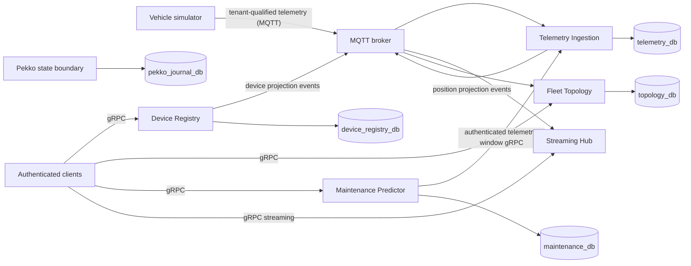
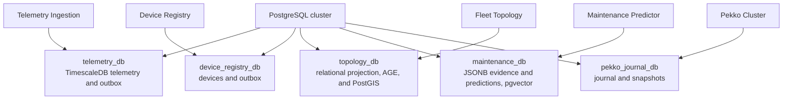
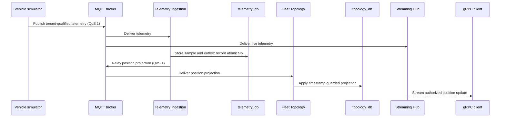
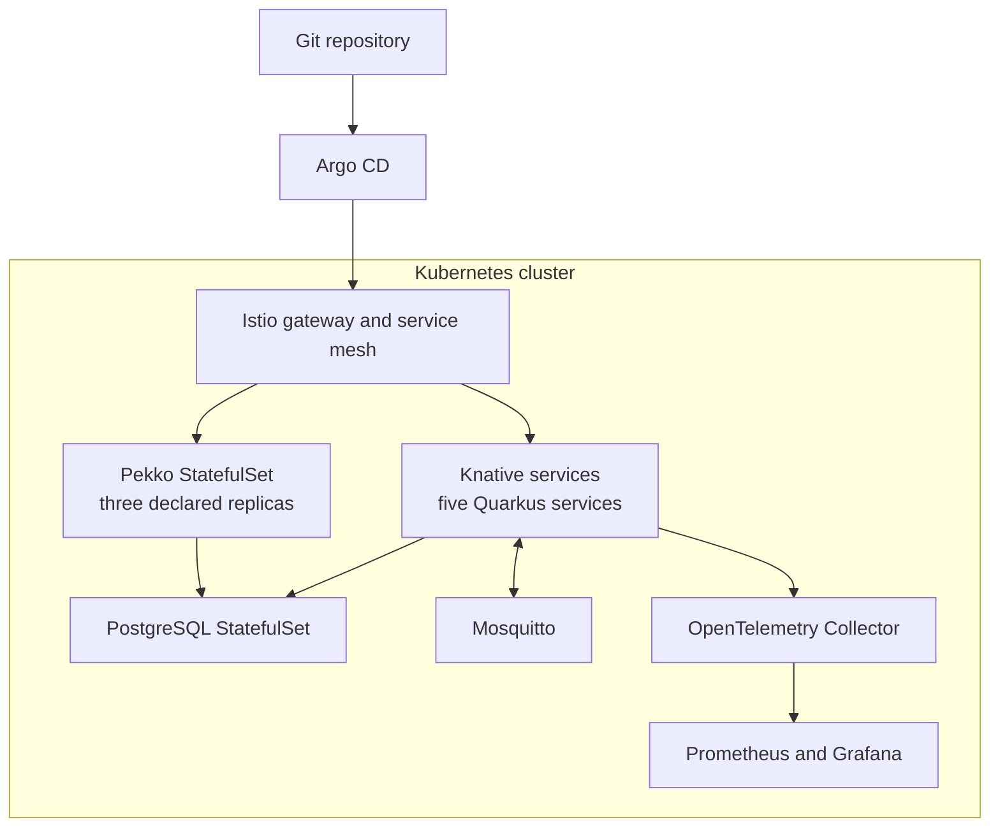

# FleetIQ Architecture Baseline

## Scope

Each deployable service remains one Maven module. Hexagonal boundaries are
enforced by packages and architecture tests. A layer is promoted to its own
Maven module only when it has an independent release lifecycle or is a stable
cross-service policy, such as `security-common` or `proto`.

## System structure

The following diagram shows implemented runtime boundaries. It deliberately
omits planned integrations until executable code and tests establish them.



Pekko is shown without a service integration edge because its Java boundary
exists, while a production transport integration has not yet been established.

## Package ownership

- `domain.model`: business state and invariants; no transport, persistence,
  Quarkus, or generated-proto types.
- `domain.port.inbound`: use-case interfaces only. Commands and results may
  remain nested here until an `application` package is introduced by a real
  orchestration need.
- `domain.port.outbound`: capabilities required by the application. Interfaces
  never expose adapter types.
- `domain.service`: use-case orchestration. It may depend on domain models,
  ports, Mutiny, and dependency-injection annotations, but never an adapter
  implementation.
- `adapter.inbound`: gRPC, MQTT, scheduler, and other driving adapters. It maps
  transport data and security context to use-case inputs.
- `adapter.outbound`: persistence, messaging, AI, and remote-client
  implementations. It maps domain values to infrastructure APIs.
- `bootstrap` or the module root: runtime startup and dependency wiring only.

## Dependency direction

```text
adapter.inbound -> domain.port.inbound -> domain.service -> domain.port.outbound <- adapter.outbound
```

Domain code must not import generated protobuf classes, gRPC, MQTT, persistence
entities, or outbound adapter implementations. Inbound adapters must not bypass
ports to call outbound adapters.

## Data ownership

Services use separate databases on one PostgreSQL cluster. Sharing the cluster
is an operational choice; it does not permit cross-service table access.



## Error policy

- Expected absence uses `Optional` or an explicit sealed application result.
- Expected business alternatives use sealed result types.
- Unexpected infrastructure failures remain failures of `Uni` or `Multi`.
- Infrastructure failures are logged once at a transport or process boundary.
- Mappers do not generate identifiers, timestamps, or business defaults.

## Tenant boundary

Authentication establishes `CurrentTenant` at inbound API boundaries. Tenant
identity must become an explicit input to every tenant-owned use case and
repository operation before multiple production tenants are enabled.

The migration must be performed as one compatibility change per service:

1. Add non-null `tenant_id` with an explicit backfill for existing development
   data.
2. Replace global keys and indexes with tenant-scoped keys, for example
   `(tenant_id, vin)`.
3. Add tenant identity to application commands and queries.
4. Require `TenantId` in outbound repository methods.
5. Prove cross-tenant denial with repository and API integration tests.
6. Optionally add PostgreSQL row-level security as defense in depth.

No adapter may silently substitute a default tenant. MQTT device principals use
`<tenant>/<vin>` and broker ACL expansion binds them to exactly
`fleetiq/<tenant>/<vin>/telemetry`. The tenant-wide multi-vehicle simulator
principal is development-only and must not be provisioned in production.

### Rollout status

- Device Registry scopes gRPC commands, repository queries, database uniqueness,
  and projection events by authenticated tenant.
- Telemetry Ingestion scopes gRPC and MQTT commands, TimescaleDB rows and
  aggregates, repository queries, and position projection events by tenant. MQTT
  broker ACLs bind device principals to their exact tenant-and-VIN topic and
  service principals to least-privilege event topics.
- Fleet Topology scopes consumed projections, relational and AGE graph identity,
  relationships, traversal, proximity queries, and authenticated gRPC calls by
  tenant.
- Maintenance Predictor scopes evidence, predictions, embeddings, repository
  queries, and authenticated gRPC operations by tenant. Future scheduled work
  must enumerate tenant work explicitly rather than inventing a request tenant.
- Streaming Hub extracts tenant identity from tenant-qualified MQTT topics and
  filters every authenticated gRPC stream by tenant before VIN selection.
- Pekko vehicle state uses tenant-and-VIN shard identity and validates tenant
  ownership again inside the actor. Future persistence IDs must preserve this
  composite identity.

## API compatibility

- Protobuf field numbers are permanent and removed fields are reserved.
- Existing enum numeric values are never renumbered.
- RPC request/response types are not changed incompatibly; introduce a new RPC
  or versioned package instead.
- Transport DTOs never become domain models.

## Topology projection

- Fleet Topology owns a local, eventually consistent Apache AGE read model and
  does not perform synchronous query-time fan-out to source services.
- Device Registry publishes device registration and status changes; Telemetry
  Ingestion publishes normalized position changes.
- Projection events are additive protobuf contracts. Producers persist them
  transactionally with the corresponding source changes.
- Scheduled relays claim pending records with `FOR UPDATE SKIP LOCKED`, publish
  them to MQTT, and remove them only after an acknowledged send. A publication
  failure rolls back the transaction, providing at-least-once delivery.
- Consumers are idempotent and reject stale updates by event timestamp. Fleet
  Topology enforces this with timestamp-guarded relational upserts.
- An accepted relational update and its corresponding Apache AGE vertex are
  synchronized in the same database transaction.
- Relationship identity and traversal metadata are stored in a relational
  projection with a matching AGE `connected_to` edge. Arbitrary edge properties
  remain in JSONB.
- Bounded traversal uses the indexed relationship projection so API queries stay
  parameterized and predictable.
- Proximity searches use the latest accepted coordinates and order vehicles by
  great-circle distance.

### Telemetry and projection flow



Device projection events follow the same outbox and relay pattern from Device
Registry to Fleet Topology. The live Streaming Hub path consumes telemetry from
MQTT; it does not currently stream from Pekko.

## Deployment model

The Kubernetes manifests declare Quarkus services as Knative services and Pekko
and PostgreSQL as StatefulSets. Istio supplies workload mTLS and ingress policy;
Argo CD owns reconciliation. This is the declared deployment topology, not a
claim that every production-readiness scenario has been proven.


